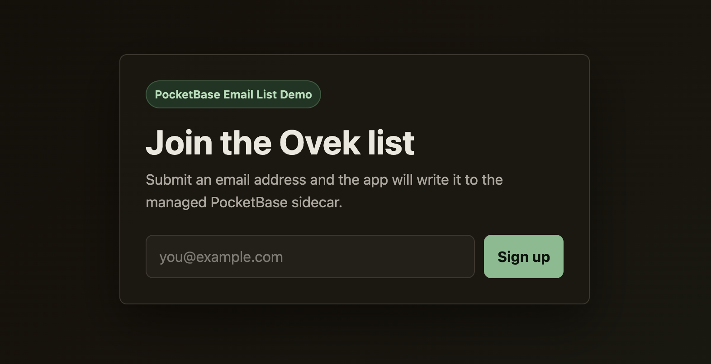

# Ovek Email List Demo

A tiny Go signup app that writes email addresses to a PocketBase sidecar deployed with Ovek.



## What This Demonstrates

- Deploying a small Go web app from source with Ovek.
- Provisioning a per-project PocketBase sidecar.
- Injecting PocketBase superuser credentials into the app as project secrets.
- Running the same app locally against a local PocketBase binary.

## Quick Start

Choose the path that matches what you want to test:

- **Deploy with Ovek:** follow [Deployment Example Using Ovek](#deployment-example-using-ovek).
- **Run the app locally without Ovek:** follow [Local Development](#local-development).

## Prerequisites

For the Ovek deployment path:

- Go, for building the `ovek` CLI from source.
- `make`.
- Podman. On macOS, this means Podman Machine.
- Permission to update `/etc/hosts` for local hostname testing.

For the local development path:

- Go, for running this app.
- A local PocketBase binary.
- direnv is optional, but useful for loading local PocketBase credentials.

## Deployment Example Using Ovek

This example can be deployed with Ovek from source. Ovek will build the app, run it behind Traefik, provision a per-project PocketBase sidecar, and inject the PocketBase credentials as project secrets.

### 1. Build Ovek From Source

```bash
git clone https://github.com/massivemoose/ovek
```

```bash
cd ovek
```

```bash
mkdir -p ./bin
```

```bash
go build -o ./bin/ovek ./cmd/ovek
```

### 2. Start Ovek With Podman

On macOS with Podman Machine:

```bash
make podman-machine-init
```

```bash
make podman-machine-rootful
```

```bash
make podman-vm-bootstrap-compose
```

```bash
make podman-vm-up
```

On Linux or a VPS with Podman:

```bash
make podman-linux-up
```

Expected: Brain, Traefik, the local registry, and BuildKit are running.

### 3. Configure Local Hostnames

For local browser testing, make sure these names resolve to the machine running Ovek:

```bash
echo '127.0.0.1 brain.localhost signup-demo.localhost' | sudo tee -a /etc/hosts
```

Only add this line if those hostnames are not already present in `/etc/hosts`.

Expected: `brain.localhost` reaches Brain through Traefik, and `signup-demo.localhost` will reach the deployed app after deployment.

### 4. Log In To The Local Brain API

```bash
./bin/ovek auth login --profile local --host http://brain.localhost --api-key dev-brain-key
```

```bash
./bin/ovek auth status
```

Expected: the active profile points at `http://brain.localhost`.

### 5. Initialize PocketBase For The Project

```bash
./bin/ovek pb init signup-demo --app-secrets
```

Expected: Ovek creates the project network, starts `ovek-signup-demo-pb`, creates or reuses a per-project PocketBase superuser, and stores `PB_SUPERUSER_EMAIL` plus `PB_SUPERUSER_PASSWORD` for the next deployment.

```bash
./bin/ovek pb status signup-demo
```

Expected: PocketBase is running, initialized is `yes`, and app secrets are configured.

### 6. Deploy The Example App

```bash
./bin/ovek deploy signup-demo https://github.com/massivemoose/ovek-signup-example
```

Expected: Ovek clones the repo, builds it with Railpack/BuildKit, pushes the image to the local registry, starts the app container, and routes `signup-demo.localhost` to it.

The first build can be slow because base images may need to download.

### 7. Check Deployment Status

```bash
./bin/ovek status signup-demo
```

Expected: After completion, project status is `running`, the app container is running, PocketBase is running, and there is a current deployment.

### 8. Open The App

Open the app in your browser:

```text
http://signup-demo.localhost/
```

Submit an email address. A successful submission redirects to `/success`.

### 9. Inspect PocketBase In The Browser

For now, create a dashboard-only local superuser manually:

```bash
./pm podman exec ovek-signup-demo-pb pocketbase --dir=/pb_data superuser upsert local-admin@signup-demo.ovek.local local-dev-password-please-change
```

Start a local tunnel to the PocketBase UI/API:

```bash
./bin/ovek pb tunnel signup-demo --listen 127.0.0.1:8091
```

Open the dashboard in your browser:

```text
http://127.0.0.1:8091/_/
```

Log in with:

```text
local-admin@signup-demo.ovek.local
local-dev-password-please-change
```

Expected: the `signups` collection exists after the app starts, and submitted emails appear as records.

### Useful Debugging Commands

Check project status:

```bash
./bin/ovek status signup-demo
```

Check PocketBase status:

```bash
./bin/ovek pb status signup-demo
```

Follow the current deploy logs:

```bash
./bin/ovek logs signup-demo
```

Show deploy logs without following:

```bash
./bin/ovek logs signup-demo --no-follow
```

Inspect the Podman stack on macOS/Podman Machine:

```bash
./pm ps -a
```

Check Brain logs:

```bash
./pm compose logs brain
```

Check the PocketBase container logs:

```bash
./pm logs ovek-signup-demo-pb
```

If `pb tunnel` says port `8090` is already in use, choose another local port:

```bash
./bin/ovek pb tunnel signup-demo --listen 127.0.0.1:8091
```

If a deploy looks stuck, rerun status and check logs. The first Railpack build may spend a while pulling base images before the app is ready.

## Local Development

This app expects PocketBase to be running locally at `http://127.0.0.1:8090`. On startup, the Go app authenticates as a PocketBase superuser, ensures the `signups` collection exists, and then serves the signup page at `http://localhost:8080`.

### 1. Install PocketBase

Download the PocketBase binary for your platform from the official PocketBase docs:

https://pocketbase.io/docs/

Place the extracted `pocketbase` executable in this repo root. The app's `.gitignore` ignores the local binary and PocketBase data directories.

### 2. Start PocketBase

In one terminal, start PocketBase:

```bash
./pocketbase serve
```

On first run, PocketBase will prompt you to create a superuser account. Follow the local setup link it prints, or open the admin dashboard:

```text
http://127.0.0.1:8090/_/
```

Keep this terminal running while you use the Go app.

### 3. Provide PocketBase superuser credentials

The Go app needs either `PB_SUPERUSER_TOKEN` or both `PB_SUPERUSER_EMAIL` and `PB_SUPERUSER_PASSWORD`.

For a one-off run, pass the credentials inline:

```bash
PB_SUPERUSER_EMAIL="admin@example.com" PB_SUPERUSER_PASSWORD="your-password" go run ./...
```

For repeated local development, you can use direnv:

https://direnv.net/docs/installation.html

Create a local `.envrc` file:

```bash
export PB_SUPERUSER_EMAIL="admin@example.com"
export PB_SUPERUSER_PASSWORD="your-password"
```

Allow direnv to load it:

```bash
direnv allow
```

Verify the variables are loaded:

```bash
env | rg '^PB_SUPERUSER_'
```

Then run the app:

```bash
go run ./...
```

Expected: the app starts on `:8080`, creates the `signups` collection if needed, and serves the form at `http://localhost:8080`.

### 4. Use the app

Open the signup app:

```text
http://localhost:8080
```

Submit a valid email address. Successful submissions redirect to `/success`; invalid or duplicate submissions redirect to `/failure`.

### 5. Inspect signups in PocketBase

Open the PocketBase dashboard:

```text
http://127.0.0.1:8090/_/
```

Sign in with the local superuser account, then open the `signups` collection to inspect submitted email records.

## Useful Commands

Run tests:

```bash
go test ./...
```

Run the app with an alternate port:

```bash
PORT=8081 PB_SUPERUSER_EMAIL="admin@example.com" PB_SUPERUSER_PASSWORD="your-password" go run ./...
```

Run the app against a non-default PocketBase URL:

```bash
POCKETBASE_URL="http://127.0.0.1:8091" PB_SUPERUSER_EMAIL="admin@example.com" PB_SUPERUSER_PASSWORD="your-password" go run ./...
```
